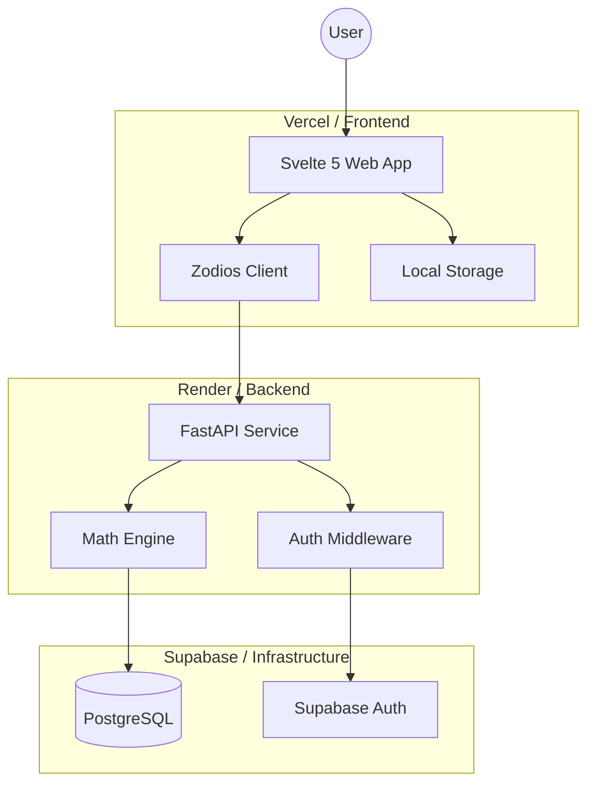

# Polyglot Powerlifting Coefficient Calculator

A high-performance, multi-stack ecosystem for calculating and tracking powerlifting scores. Built for precision, speed, and learning.



## 🚀 The Mission
This project serves as a masterclass in **cross-stack deployment**. We implement the same core business logic (powerlifting math) across multiple backend and frontend technologies to compare developer experience, performance, and type-safety patterns.

### Current Stacks
- **Backend API**: Python 3.12 + FastAPI (Async)
- **Web Frontend**: Svelte 5 (Runes) + Tailwind v4
- **Mobile (Planned)**: Flutter & React Native

---

## 🛠 Features
- **Precision Math**: Official Wilks, DOTS, IPF GL (2020), and Reshel support.
- **Hybrid Persistence**: Anonymous users use local storage; logged-in users sync to the cloud via Supabase.
- **Type-Safe Contract**: Zodios generated client ensures 100% frontend/backend sync.
- **Modern UX**: Svelte 5 runes for smooth, reactive calculations.

---

## 📚 Documentation
- **[Powerlifting Formulas](docs/formulas.md)**: Deep dive into the coefficient math and polynomial constants.
- **[Database Schema](docs/schema.sql)**: The PostgreSQL structure for auth-synced calculations.
- **[API Guide](docs/api.md)**: Integration instructions for third-party developers and the Supabase auth lifecycle.
- **[Architecture Lore](docs/architecture.md)**: The "why" behind Svelte 5 runes, Zodios, and our stability guard patterns.
- **[Branding Guide](docs/branding.md)**: Design tokens, typography, and visual identity for all 3 apps.
- **[Learning Plan](LEARNING_PLAN.md)**: The sequential step-by-step evolution of this codebase.

---

## 🏗 Setup & Development

### Prerequisites
- **WSL 2** (Ubuntu recommended)
- **uv** (for Python 3.12+)
- **pnpm** (for Node/Svelte)

### Developer Setup
For a full guide on setting up your local environment (Node, Python, WSL, etc.), see **[Phase 0 of the Learning Plan](LEARNING_PLAN.md#phase-0--prep--infrastructure-do-this-before-coding)**.

### One-Command Dev
```bash
make dev
```
*This will spin up both the FastAPI backend and the SvelteKit frontend concurrently.*

### Run Tests
```bash
make api-test    # Backend Unit & Integration
make web-test    # Frontend Vitest
make e2e-test    # Cross-stack Playwright browser tests
```

---

## 🤝 Project Credits
Created as a professional learning project to master modern web and mobile architectures.
- **Math Engine**: FastAPI
- **Reactive Layer**: Svelte 5
- **Infrastructure**: Supabase, Render, Vercel