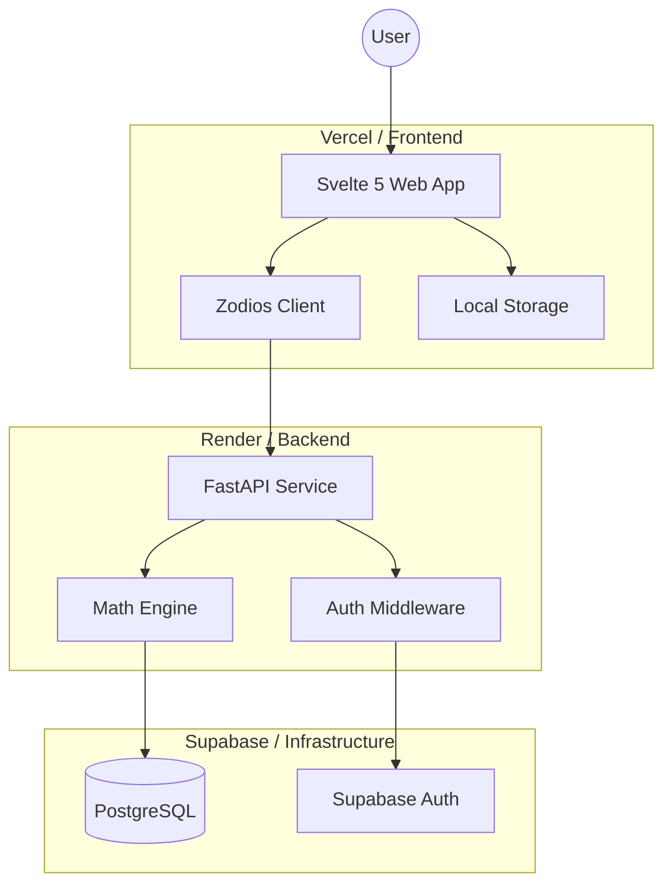

# Architecture Reference

This document provides a high-level visual and structural reference for the Polyglot ecosystem. For the pedagogical "Why" behind these decisions, see [MASTER_LORE.md](file:///home/preese/workspace/polyglot-powerlifting/docs/MASTER_LORE.md).

## 0. System Overview

---

## 1. Core Architectural Pillars

| Component | Responsibility | Technology |
| :--- | :--- | :--- |
| **Logic Core** | Mathematical coefficients and ML forecasting. | FastAPI (Python) |
| **User Interface** | Reactive, high-performance web experience. | Svelte 5 (TypeScript) |
| **Data Bridge** | Type-safe, contract-first communication. | Zodios / OpenAPI |
| **Infrastructure** | Database, Authentication, and Hosting. | Supabase / Render / Vercel |

---

## 2. Key Pattern Maps
Explore the deep-dives for these architectural patterns in the [Lore Bible](file:///home/preese/workspace/polyglot-powerlifting/docs/MASTER_LORE.md):

- **State Sync**: [Stability Guard Logic](file:///home/preese/workspace/polyglot-powerlifting/docs/MASTER_LORE.md#3-the-stability-guard-pattern)
- **Persistence**: [Dual-Buffer State Patterns](file:///home/preese/workspace/polyglot-powerlifting/docs/MASTER_LORE.md#part-ii-the-lifecycle-of-a-lift-a-trace)
- **Security**: [PostgreSQL Row Level Security (RLS)](file:///home/preese/workspace/polyglot-powerlifting/docs/MASTER_LORE.md#2-the-repository-pattern--row-level-security-rls)
- **Deployment**: [Environment Parity & Monorepos](file:///home/preese/workspace/polyglot-powerlifting/docs/MASTER_LORE.md#part-vii-deployment--the-monorepo-how)
