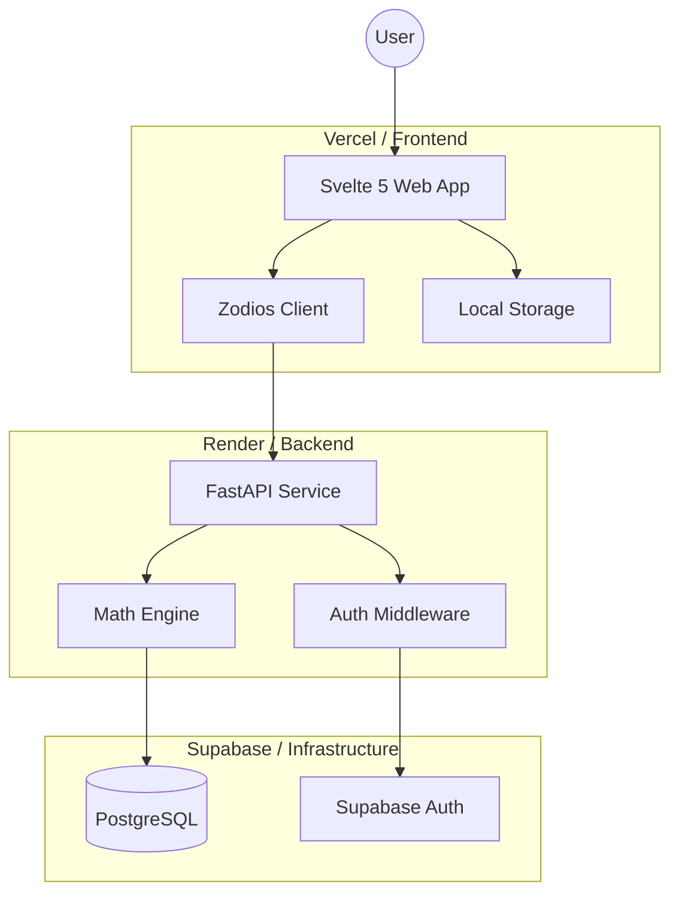

---

## 0. System Overview
To understand the "lore," one must first see the battlefield. Here is the high-level architecture of the Polyglot ecosystem:

## 1. State Management: The "Stability Guard" Pattern
In Svelte 5, using runes like `$effect` can lead to infinite feedback loops if the effect modifies the same state it reacts to. 

### The Problem
In `HistoryState`, a change in the `user` status would trigger a `_loadCloudHistory()` call. If the API returned an empty list or failed, the UI might re-render, potentially causing a re-calculation of the effect and another API call, creating an infinite loop of 401s or empty requests.

### The Lore
We implemented a **Stability Guard** using `_lastLoadedUserId` and a `force` parameter. 
- **The Guard**: Before fetching, we check if `_lastLoadedUserId === user.id`. If matches, we skip the fetch.
- **The Reset**: We only bypass this check explicitly (e.g., during a manual `Sync`) by passing `force=true`.
- **The Loading Flag**: We use an `isLoading` flag to ensure multiple overlapping requests never fire simultaneously.

## 2. End-to-End Type Safety: Why Zodios?
Manual `fetch` calls and handwritten TypeScript interfaces are a "maintenance trap"—if the backend changes a field name, the frontend breaks silently.

### The Choice
We adopted **Zodios** in the Svelte frontend. 
1. **Contract First**: The FastAPI backend serves as the source of truth via its auto-generated `openapi.json`.
2. **Zero Manual Types**: We use a generator to turn that JSON into Zodios schemas.
3. **The Result**: If the backend team changes a `LiftResponse` field, the frontend build will **fail** immediately until the code is updated. This moved our errors from runtime to compile-time.

## 3. The "Ghost 401" and Environment Parity
We spent several hours chasing a 401 Unauthorized error that appeared in production but never locally.

### The Discovery
The frontend was sending valid tokens, and the backend was initialized... but the backend on Render was configured with the **Development** Supabase URL, while the frontend on Vercel was using **Production** credentials.
- **The Lesson**: In a cross-stack deployment, **Environment Parity** is critical. A JWT issued by "Project A" can never be verified by "Project B," even if the code is identical.
- **The Fix**: Standardized on `SUPABASE_URL` and `SUPABASE_ANON_KEY` as the primary environment variables across all stacks.

## 4. CORS: Wildcards vs. Credentials
We initially faced issues where the `Authorization` header was being stripped or rejected by browsers in production.

### The Decision
We set `allow_credentials=False` in our FastAPI `CORSMiddleware`. 
- **Reasoning**: When using `Authorization: Bearer` tokens, you do not need browser-managed "credentials" (like cookies). 
- **The Benefit**: Setting this to `False` allowed us to use the wildcard `allow_origins=["*"]` more flexibly during early deployment while maintaining security.

## 5. Mobile UX: Results-First
On small screens, the classic "Form on Top, Results on Bottom" layout fails because the virtual keyboard hides the results card.

### The Solution
We've optimized the layout to prioritize the **Results Card** immediate visibility. The "lore" here is a commitment to a mobile-first gesture experience: as soon as "Calculate" is pressed, the focus must shift or the layout must adapt so the user doesn't have to scroll to see their score.
